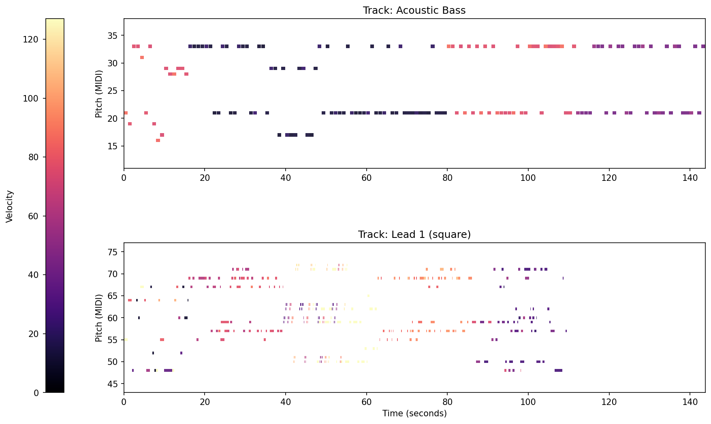

# 🎧 Listen to Randomness

Generating music from randomness — so you can listen to chance.

Listen to Randomness is an experimental project that transforms randomness (or pseudo-randomness) into structured musical output.
The goal is simple and poetic: make randomness audible.

Instead of treating randomness as noise, this project explores how algorithmic generation can produce emergent musical structures — melodies, rhythms, motifs — that allow us to hear probability in action.

## ✨ Concept

Randomness is often invisible — hidden inside algorithms, cryptography, simulations, or statistical models.

This project asks:

What if randomness could be heard?

By mapping random values to musical parameters such as pitch, duration, rhythm, and structure, the system generates music that exists somewhere between chaos and pattern.
Depending on configuration, the output can be:

- Fully random
- Seeded (deterministic pseudo-random)
- Structured with musical constraints
- Style-aware (planned feature)

## 🚀 Features

Current

- 🎲 Random / pseudo-random music generation
- 🎵 Melody and rhythm construction from probabilistic sources
- 🔁 Deterministic generation via seeds (when applicable)
- 🧩 Role-based musical logic (depending on current implementation)

Here is what can be set as random in music:

| Element       | Example of randomness                   |
| ------------- | --------------------------------------- |
| Notes         | within a scale or free                  |
| Octaves       | 3 to 6, weighted by role                |
| Rhythm        | variable durations, rests, syncopations |
| Dynamics      | 40–127, crescendos                      |
| Instruments   | per track, according to musical role    |
| Wave Type     | sine / square / saw / triangle          |
| ADSR          | attack, decay, sustain, release         |
| Articulations | staccato / legato / trills              |
| Structure     | motifs, sections, progressions          |
| Tempo         | 60–180 BPM, or variations               |
| Musical Form  | AABA, ABA, etc.                         |

🛠️ Roadmap / TODO

📜 Score Generation (Partition)

- [ ] Generate sheet music (standard notation and/or neumatic-style notation)
- [ ] Separate tracks by musical role (melody, harmony, rhythm, bass, etc.)

📊 Visualization

- [ ] Graphical representation of melodic or rhythmic patterns
- [ ] Phrase and motif diagrams
- [ ] Structural analysis visual output

🎼 Styles

- [ ] Support for different musical styles (Classical, Jazz, Pop)
- [ ] Style-specific motifs and role behaviors
- [ ] Harmonic and rhythmic constraints per genre

🧠 Philosophy

This project sits at the intersection of:

- Algorithmic composition
- Generative art
- Probability theory
- Deterministic chaos
- Experimental music

It is not about replacing composition —
it is about exploring the boundary between randomness and intention.

🔧 Installation

```bash
git clone https://github.com/pinka-code/listentorandomness.git
cd listentorandomness
python -m pip install -e .
```

▶️ Usage

```bash
ltr-generate-midi # post install

# launch a random composition
python -m listener_to_randomness.cli.generate_midi --output output.mid

# launch main demo script that shows influence of randomness to music pitches
python -m listener_to_randomness.cli.generate_rng_demo demo

# launch data visualisation (music over time)
python -m listener_to_randomness.cli.visualize --midi_file output.mid src/listener_to_randomness/visualisation/plots --mode timeline

# launch data visualisation music analysis
python -m listener_to_randomness.cli.visualize --midi_file output.mid src/listener_to_randomness/visualisation/plots/midi_analysis --mode analysis
```

Launch unit tests

```bash
python -m pytest
```

🎹 Example Output

- MID: generative_structured.mid
- Visualisation: 